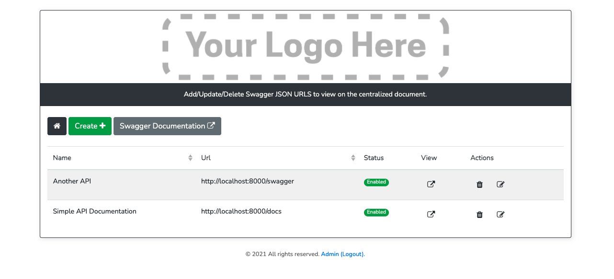
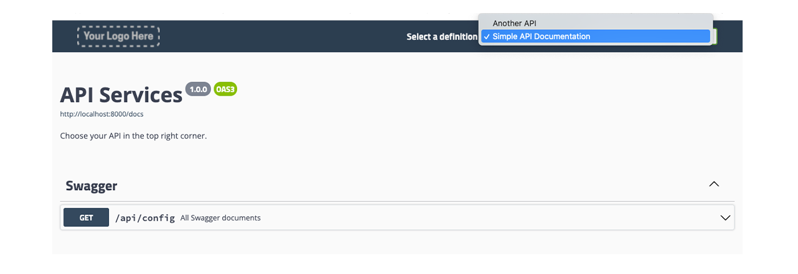

## Swagger-UI

A centralized Swagger instance for your many microservices.  Built with PHP/Laravel and a small CRUD interface built in Vue - Bootstrap-Vue.  Add your links
in the interface, the Swagger Document page will present each url in a drop down menu on the document.

How to run:

Copy .env.example to .env

Run Composer:

``composer install``

Run migrations & seed ( Don't forget to set up a database ):

``php artisan migrate:refresh --seed``

Create a user:

``php artisan app:create-user``

Build the initial Swagger Document:

``php artisan l5-swagger:generate``

Run NPM:

``npm install ``

``npm run dev``

Visit localhost:8000!

